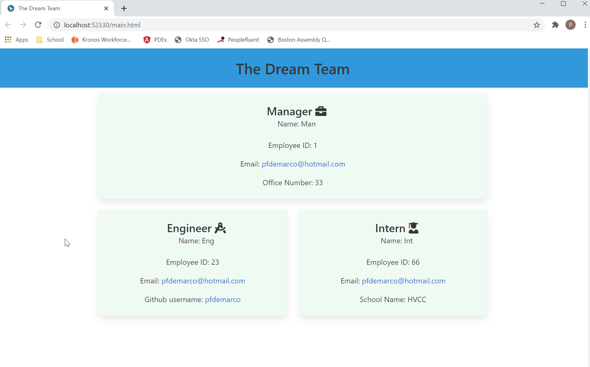

# Team-Profile-Generator

Make a command line tool that takes user input for team members and creates html pages based on that info

This application runs by typing node index.js into a command line.

The user will be prompted with 4 selections Manager, Engineer, Intern or None.

Selecting Manager prompts

*  Enter Manager Name:

*  Enter Manager ID:

*  Enter Manager Email:

*  Enter Manager Office number:

Selecting Engineer prompts

*   Enter Engineer Name:

*   Enter Engineer ID:

*   Enter Engineer Email:

*   Enter Engineer GitHub Username:

Selecting Intern prompts
*  Enter Intern Name:
*  Enter Intern ID:
*  Enter Intern Email:
*  Enter Intern School:

Selecting None stops the prompts and creates the html file with the employee cards in main.html.

# GitHub repo
https://github.com/pfdemarco/Team-Profile-Generator

# Video of test and app
https://drive.google.com/file/d/1vRqcPmkCmqole4hiGnV_9idodYQfixNP/view

# Sample of HTML page created 
https://pfdemarco.github.io/Team-Profile-Generator/main.html

